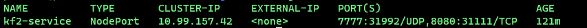

# KF2-Kubernetes

This server runs with kubernetes. In my setup, it's a on-prem k8s - but this can also be done by using Kind or MiniKube.
It's a functional setup that doesn't advertise the server on the server list. It's thought as a private server for you and your friends.

> This setup is for a linux server!
> There are dummy/default values in the .yaml files (marked by a comment) - make sure that you filled them with your respective values

> Some knowledge of linux, port-forwarding and kubernetes can help you out a lot here. I can't guarantee that you can get it to run without said knowledge, as troubleshooting won't be easy otherwise.

## Setup Kind

First, you need to [install Kind. Follow the official docs.](https://kind.sigs.k8s.io/docs/user/quick-start/#installation). Install [kubectl](https://kubernetes.io/docs/tasks/tools/) as well - this allows you to deploy according to this doc.

Once that is done, make sure to clone this repo with `git clone https://github.com/patrick-men/KF2-Kubernetes.git`.

Now we need to create the kind cluster. For this, I've prepared a `cluster.yaml` file that starts a cluster with the required settings. Simply change directory into the cloned repository, and run `kind create cluster --config cluster.yaml --name kf2server-cluster`. With the cluster running, we create a namespace for the server - this is for the sake of completeness regaring kubernetes + the .yaml files are set to deploy into a namespace with the given name - by running `kubectl create namespace kf2-server`.
Now we need to deploy the kubernetes resources required for the server to run. Change directory into `/kind-deployment`, and then run `kubectl create -f .`.

## _Optional, to see installation progress_

With this done, you can run `kubectl get pods -n kf2-server` - this will show you the pod running the game server. Copy the name of the pod (should be something along the lines of `kf2-game-server-...`). Next up, run `kubectl logs -f <pod-name> -n kf2-server`: This shows you the live logs of the installation process of the server. Once it's done, you should see something along the lines of `DevOnline: Sending out playfab requests...`.

> Note that the first installation can take a while - in my case, with HDDs, it took 20-30 minutes.

### tl;dr

1. Install [kind](https://kind.sigs.k8s.io/docs/user/quick-start/#installation) and [kubectl](https://kubernetes.io/docs/tasks/tools/)
2. `git clone https://github.com/patrick-men/KF2-Kubernetes.git`
3. Change directory into cloned repository > `kind create cluster --config cluster.yaml --name kf2server-cluster`
4. `kubectl create namespace kf2-server`
4. `kubectl create -f .`
_Optional_
6. `kubectl get pods -n kf2-server`
7. Copy the name of the pod listed
8. `kubectl logs -f <pod-name> -n kf2-server` to show you live logs

## Setup MiniKube

First, you need to install [minikube](https://minikube.sigs.k8s.io/docs/start/). Install [kubectl](https://kubernetes.io/docs/tasks/tools/) as well - this allows you to deploy according to this doc.

Once that is done, make sure to clone this repo with `git clone https://github.com/patrick-men/KF2-Kubernetes.git`.

Now we can start creating the cluster. With minikube, that is done with `minikube start -p kf2-server`.

With this done, we can start working on preparing the environment: Run `kubectl create namespace kf2-server` to create a namespace for the server to run in. The next step is to deploy the kubernetes resources required for the server to run. Change directory into `/minikube-deployment`, and then run `kubectl create -f .`.

## _Optional, to see installation progress_

With this done, you can run `kubectl get pods -n kf2-server` - this will show you the pod running the game server. Copy the name of the pod (should be something along the lines of `kf2-game-server-...`). Next up, run `kubectl logs -f <pod-name> -n kf2-server`: This shows you the live logs of the installation process of the server. Once it's done, you should see something along the lines of `DevOnline: Sending out playfab requests...`.

### tl;dr

1. Install [minikube](https://minikube.sigs.k8s.io/docs/start/) and [kubectl](https://kubernetes.io/docs/tasks/tools/)
2. `git clone https://github.com/patrick-men/KF2-Kubernetes.git`
3. `minikube start -p kf2-server`
4. `kubectl create namespace kf2-server`
5. `kubectl create -f .`
_Optional_
6. `kubectl get pods -n kf2-server`
7. Copy the name of the pod listed
8. `kubectl logs -f <pod-name> -n kf2-server` to show you live logs

## Connecting to the server

With everything set up, it's time to play.. but you first need to set up a few more things :D

Firstly, you need to find out what port on your local device/server listens and communicates to the game server. You can find that by running `kubectl get svc -n kf2-server` - this will show you what port you need to aim at.

Example: 

In this screenshot we can see that the port 7777 has been mapped to 31992, and port 8080 to 31111. These are the ports that need to be port-forwarded to.

### Port-Forwarding

> This is done at your own risk - be sure to know the risks of port-forwarding. 

Go into your router, and forward a port of choice (this one will be used by your friends to connect) to the port that 7777 is mapped to (in my case, 31992). Now your friends can connect doing the following in-game:

1. Press F3
2. Type `open <your-public-ip>:<port>`

---

## Infos Kubernetes deployment

The kubernetes deployment consists of:

- Deployment
- PV
- PVC
- NodePort

The deployment contains the image `gameservermanagers/gameserver:kf2`, which is a ready-to-use KF2-Server. As such, it was mainly required to implement it into kubernetes.

### Deployment

The Deployment contains the image that will run the server. It has the `/data` directory of the image mounted to your local device - this allows you to kill the entire server and start it again without any data loss, as well as there being a way shorter startup time once eveverything has been installed.

### NodePort

The NodePort forwards the ports `7777` and `8080`:

- `7777`: Game port
- `8080`: WebAdmin

Port `7777` is used to connect to your game, and is the one that you will need to port-forward to (following the hints above).
Port `8080` is used for you to access the WebAdmin interface.

### Configuration

> Please follow [the offical docs](https://wiki.killingfloor2.com/index.php?title=Dedicated_Server_(Killing_Floor_2)) for these steps.

For this to work, the game server files themselves needed some configuraion. This was mainly for the WebAdmin and password protection.
This was done in `/mountpath/data/serverfiles/KFGame/Config/kf2server/LinuxServer-KFGame.ini // KFWeb.ini`. The main configuraions were enabling WebAdmin, as well as setting a password, both for WebAdmin, as well as for the server itself.

### Workshop maps

TBD